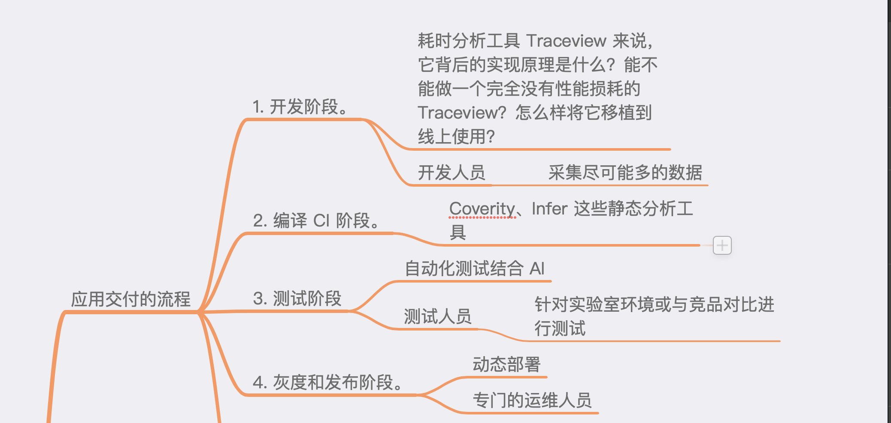

# 导读 \| 如何打造高质量的应用？

### 课程介绍

Android开发高手课 张绍文

1、专栏“高质量开发”模块

主要对应的是开发阶段，你可以带着实践过程的困惑去深入学习开发需要的各种武器。

2、专栏“高效开发”模块

主要对应编译 CI、测试、灰度和发布阶段，你可以结合实际工作全面提升整个应用交付的效率。

3、架构演进

另外，我认为一个好的架构可以减少甚至避免团队出错，也是打造一款高质量应用非常重要的一环，因此我会在最后的“架构演进”模块和你聊聊如何设计一个好的架构，以及架构该如何选型。

### 

### 应用交付的流程

### 移动 APM 质量平台

“Application Performance Management”，即应用性能管理

**1. 统一管理**。

一个统一的平台，整合应用的人员和开发流程

**2. 统一三端**。

个公司可能有多个应用，一个应用也可能有 H5、iOS、Android 多个端。

我们希望它们只是采集数据方式有所不同，上报、后台分析、展示、报警都是共用的。

随着技术的发展，我们可能会增加 React Native、Flutter 这些新模块的监控，这个平台应该是统一演进的。

### 质量平台需要关注问题

